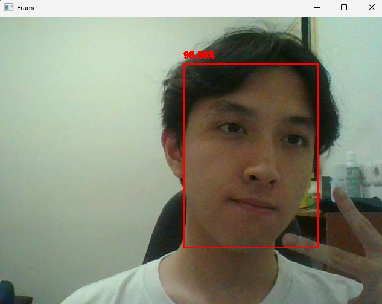

# Face Detection

Have you seen those machines that like detects human faces? I wanted to try something similar, but simpler ofc!

This is a computer vision program that detects human faces in a live webcam video using a pre-trained deep learning model. 

## Overview

The program loads a MobileNet SSD model trained with the Caffe framework and uses it to detect faces in an image or video stream. Detected faces are highlighted with bounding boxes and a confidence score label. The same pipeline works on both images and real-time webcam input.

## Concepts Learned

- Deep learning for image classification vs detection
- What a pre-trained model is and why it's useful
- Loading Caffe `.prototxt` and `.caffemodel` files with OpenCV's DNN module
- Understanding detection output tensors (confidence scores, bounding box coordinates)
- Drawing bounding boxes with `cv2.rectangle()` and `cv2.putText()`
- Processing live webcam frames for real-time detection

## Screenshots / Output



## Setup

```
pip install opencv-python numpy
```

Download the model files:
- `deploy.prototxt`
- `res10_300x300_ssd_iter_140000.caffemodel`

